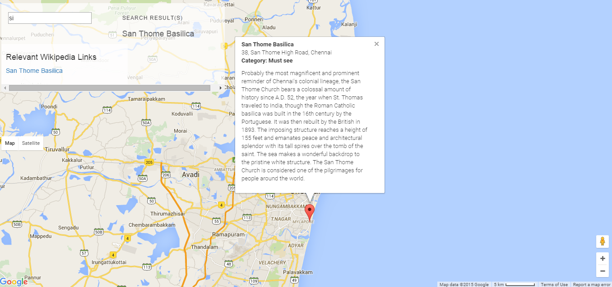

## Neighborhood Map project

* </img>
My application shows places on Google Map in Chennai that I have thoughtfully chosen previously.

To select places you can either use the searchbar and type a word, the search being case insensitive, or by clicking on filter bar, you can choose a category to show respective locations. The category filter view hides when mouse leaves.

To know more information about selected places, you only need to click on the place and related Wikipedia links might appear if any, or you can click on the marker and an infowindow will feed you information.

I had much fun to select locations and build the application that I count to use during my trip to Chennai in Nov 2015, hopefully by the time as a FEND graduated student. 

### Getting started

Copy the below URL to your web browser:

 http://pianove.github.io/Neighborhood-Map-Project

The development source code is under the default branch called Knockout and folder '/js/script.js' on github:
https://github.com/pianove/Neighborhood-Map-Project

The production code is linted/optimized and minified with gulp under 'public/js'.

### Libraries and API used

* [Knockout](http://knockoutjs.com/index.html "knockout doc")
* [Google Maps API](https://developers.google.com/maps/documentation/javascript/ "Google Maps API") 
* [Wikipedia API](http://www.mediawiki.org/wiki/ "Wikipedia API") 

### Remaining Issues

The speed score is very low due to  render-blocking JavaScripts which are knockout, jquery, googlemaps and script.js.
 
### Resources
* [Error handling](http://ruben.verborgh.org/blog/2012/12/31/asynchronous-error-handling-in-javascript/)
* [Search box embellishing](http://webdesign.tutsplus.com/tutorials/css-experiments-with-a-search-form-input-and-button--cms-22069)
* [Binding handlers with map](https://groups.google.com/forum/#!searchin/knockoutjs/google$20map/knockoutjs/yIM7_ALFVE8/ipQO5bOKkegJ)
* [Setting up http server on Windows](http://www.jhh.me/blog/2012/12/24/setting-up-http-server-on-windows-with-node-js/)

### Customization with Bootstrap
The application was built on <a href="http://getbootstrap.com/">Bootstrap</a> framework. All custom styles are inlined in the portfolio repo.

* <a href="http://getbootstrap.com/css/">Bootstrap's CSS Classes</a>
* <a href="http://getbootstrap.com/components/">Bootstrap's Components</a>

License

MIT License